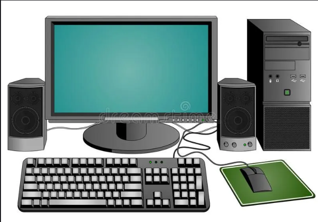

# What is a Computer

> Do you know what a computer is? Can you give some examples?

A computer is an electronic device that accepts data as input, processes it, and gives output. It can store and retrieve information quickly and accurately.

**Parts of a Computer and the Human Body**

> Can you guess which body part matches with the computer parts I will show you?

| Computer Part               | Human Body Part   | What it does                       |
| --------------------------- | ----------------- | ---------------------------------- |
| **CPU (Brain)**             | Brain             | Thinks and makes decisions         |
| **Memory (RAM)**            | Short-term memory | Remembers things for a short time  |
| **Hard Drive**              | Long-term memory  | Stores information for a long time |
| **Speakers**                | Mouth             | Gives us sound                     |
| **Microphone**              | Ears              | Hears sound                        |
| **PSU (Power Supply Unit)** | Food              | Supplies power                     |
| **Monitor**                 | Eyes              | Shows us information               |
| **Keyboard**                | Hands             | We use it to give information      |
| **Mouse**                   | Hands             | We use it to point and click       |

> Now tell me, what are the uses of a computer? Have you used a computer before? What did you use it for?

---

# What is Programming

> Have you ever wondered how something works automatically?
> You just press a button, and a message is sent to your friend like magic!

That's where the word **Programming** comes in.

A **Program** simply means giving a list of instructions to a computer, and it will follow the instructions one by one.

> Let's take an example:

* We take a sheet of paper.
* Write down some instructions on it, for example:

  1. Go to the market
  2. Buy a pencil and a notebook
  3. Give money to the shopkeeper
  4. Come back home
* Now the paper is given to you.
* You read the lines and follow the instructions one by one.

> This paper is called a **program**, and making the list is called **Programming or Coding**.

---

# What is a Language

> Now think about all the ways someone can make a list:

* Writing with a pencil
* Writing with a pen
* Writing on paper
* Writing on your phone
* Asking someone by call

Similarly, in programming we have many languages: Python, Java, C, JavaScript, C++, etc.

All languages are good and can complete tasks, but they have their own advantages and disadvantages.

For example:

* "Writing on paper takes more effort, while asking on the phone is easier, but writing on paper is faster."
* Similarly, "Python code is slow but easy to write, while Java code is fast but harder to write."

> Now you understand the need for different programming languages.

Visit: [https://raygun.com/blog/programming-languages/](https://raygun.com/blog/programming-languages/)

---

# What is Code

> Have you ever seen movies where spies talk in code? It’s the same idea here.

In that list, if you write any of these:

* Buy pencil and notebook
* Buy notebook and pencil
* Buy notebook, pencil

You can easily understand what it is trying to say.

But a computer cannot understand our human language. That’s why scientists made their own language to talk with computers. This is called a **Coding language** or **Code**.

# Task

## Show Python code example

Visit: https://www.programiz.com/python-programming/online-compiler/

## Example

Visit: https://scratch.mit.edu/projects/1216147152/editor/